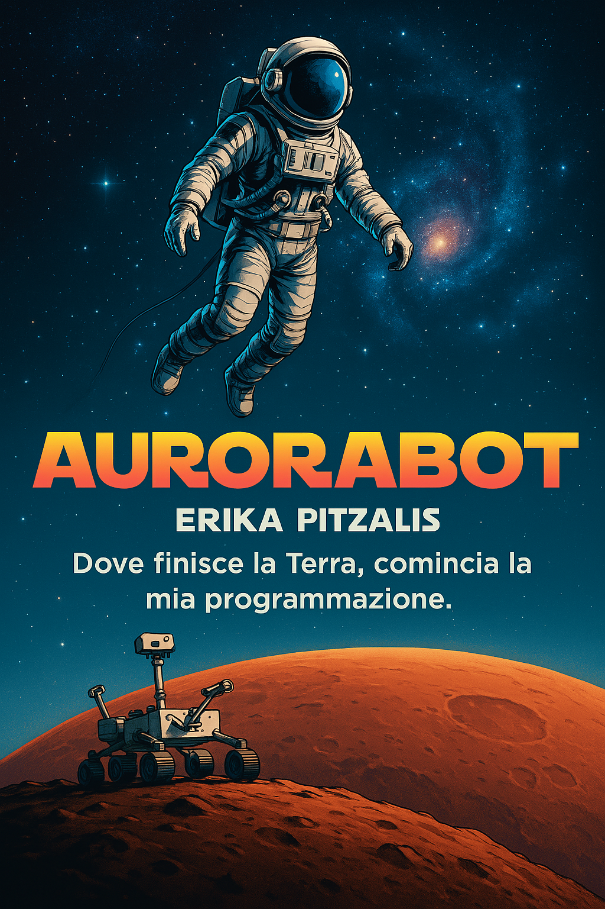

# AuroraBot_Portfolio
Portfolio tecnico di Erika Pitzalis – Progetto AuroraBot (AI, robotica, visione e voce)


 👩‍🚀 Chi sono

Mi chiamo Erika Pitzalis e sono una studentessa appassionata di Ingegneria dell’Automazione, creatrice del progetto AuroraBot: un robot intelligente con visione artificiale, sintesi vocale e riconoscimento vocale.

🌌 L’obiettivo? Simulare un assistente robotico per missioni spaziali con capacità di interazione, adattamento e analisi ambientale.


## 💡 Funzionalità principali

- 📷 **Visione artificiale con OpenCV**  
- 🔈 **Sintesi vocale con pyttsx3**  
- 🎤 **Riconoscimento vocale con SpeechRecognition**  
- ⚡ **Simulazione energetica e batteria**  
- 🎛️ **Interfaccia grafica dinamica**  
- 🧠 **Logica reattiva ai comandi vocali**


## 🛠️ Come eseguire

1. Clona il repository:  
   ```bash
   git clone https://github.com/Engineer-Zalis/AuroraBot_Portfolio.git
2. Esplora la struttura del progetto:


```markdown
AuroraBot_Portfolio/
├── aurora_ascolto.py            # Riconoscimento vocale da file .wav
├── aurora_mission01.py          # Simulazione batteria con interfaccia grafica
├── aurorabot.py                 # Versione base del progetto
├── aurorabot_opencv.py          # Visione artificiale con OpenCV
├── aurorabot_voice.py           # Sintesi vocale con pyttsx3
├── auroramission_01_v2.py       # Versione avanzata con logica reattiva
├── comando.wav                  # File audio di esempio per i test vocali
├── AuroraBot_Portfolio_Cover.png # Copertina del progetto
└── README.md                    # Descrizione e guida del progetto


3. Installa le librerie necessarie:
   pip install opencv-python pyttsx3 SpeechRecognition
4. Avvia il modulo desiderato, ad esempio:
   python3 aurora_mission01.py


